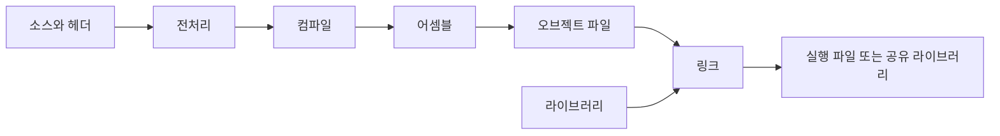

# 빌드 과정과 용어

빌드(Build)는 소스코드와 설정, 의존성을 입력으로 받아 사용할 수 있는 결과물을 만드는 과정입니다. 컴파일 외에도 코드 생성, 리소스 복사, 번들링, 패키징이 포함될 수 있습니다.

## C/C++에서 보는 빌드 단계



| 단계 | 하는 일 | 대표적인 실패 |
| --- | --- | --- |
| 전처리(Preprocessing) | `#include`와 매크로, 조건부 컴파일 처리 | 헤더를 찾지 못함 |
| 컴파일(Compilation) | 구문·타입을 검사하고 코드를 변환 | 문법 오류, 타입 불일치 |
| 어셈블(Assembly) | 어셈블리 코드를 기계어 오브젝트로 변환 | 대상 CPU에서 지원하지 않는 명령 |
| 링크(Linking) | 오브젝트와 라이브러리의 심볼 참조를 연결 | 함수 정의 누락, 중복 정의 |

컴파일은 좁게는 위 변환 단계, 넓게는 오브젝트 생성까지를 가리키기도 합니다. 실제 도구는 중간 파일을 디스크에 남기지 않고 여러 단계를 수행할 수 있습니다.

### 선언, 정의, 심볼

```c
int add(int a, int b);                 // 선언: 이름과 타입을 알림
int add(int a, int b) { return a + b; } // 정의: 실제 구현을 제공
```

선언만 있어도 함수를 호출하는 소스를 컴파일할 수 있습니다. 하지만 링크 시점에는 사용할 정의가 필요합니다. **심볼(Symbol)**은 함수나 전역 변수 등을 식별하는 이름이며, 링커는 심볼 참조를 해당 정의와 연결합니다.

헤더를 포함했다고 그 함수의 구현까지 자동으로 링크되는 것은 아닙니다.

## 라이브러리와 실행 시점

| 형태 | 빌드·실행 특성 | 주의점 |
| --- | --- | --- |
| 정적 라이브러리 | 링크할 때 필요한 오브젝트 코드가 결과물에 포함됨 | 라이브러리 변경을 반영하려면 다시 링크해야 함 |
| 공유·동적 라이브러리 | 실행 시 로더가 라이브러리를 연결하거나 프로그램이 동적으로 로드 | 실행 환경의 경로, 버전, ABI 호환성 필요 |

정적 라이브러리는 Unix 계열에서 보통 `.a`, 공유 라이브러리는 Linux에서 `.so`, macOS에서 `.dylib`를 사용합니다. Windows의 `.lib`는 정적 라이브러리 또는 DLL용 임포트 라이브러리일 수 있습니다.

**ABI(Application Binary Interface)**는 바이너리끼리 호출할 때의 규약입니다. CPU 아키텍처, 호출 규약, 데이터 배치 등이 맞아야 합니다. API가 같아 보여도 ABI가 다르면 기존 바이너리를 그대로 사용할 수 없습니다.

## 다른 생태계의 빌드

| 생태계 | 흔한 과정 | 결과물 예시 |
| --- | --- | --- |
| Java | 소스 → 바이트코드 컴파일 → 리소스 포함·패키징 | `.class`, `.jar` |
| TypeScript/웹 | 타입 검사, 변환, 번들링, 압축, 자산 처리 | JavaScript, CSS, 이미지 |
| Rust | 의존성 해석 → 컴파일·링크 | 실행 파일, 라이브러리 |
| Python | 배포 메타데이터·패키지 생성, 필요하면 네이티브 확장 컴파일 | wheel, 소스 배포본 |

웹 도구가 TypeScript 문법을 제거해도 타입 검사를 수행하지 않을 수 있습니다. 타입 검사 명령과 실제 번들 생성 명령을 구분해서 확인합니다. Python wheel에도 네이티브 코드가 들어갈 수 있으므로 모두 플랫폼 독립적인 것은 아닙니다.

JavaScript의 변환·번들링 단계는 [모듈과 번들링 원리](./javascript-modules.md), 실제 명령 구성은 [개발·배포 빌드](./javascript-workflows.md)를 참고합니다.

## 빌드와 인접 작업 구분

- **의존성 해석·설치**: 사용할 외부 패키지의 버전을 결정하고 가져옵니다.
- **구성(Configure)·생성(Generate)**: 도구와 옵션을 확인하고 빌드 규칙을 준비합니다. CMake에서 명확히 드러나는 단계입니다.
- **테스트(Test)**: 결과가 기대대로 동작하는지 검증합니다. 빌드 성공만으로 테스트 성공을 보장하지 않습니다.
- **패키징(Package)**: 실행 파일, 리소스, 메타데이터를 배포 형식으로 묶습니다.
- **배포(Deploy)**: 결과물을 실행 환경에 전달하고 적용합니다.

CI는 이 작업들을 자동으로 실행하는 환경입니다. 로컬 빌드 명령과 CI에서 사용하는 빌드 명령을 맞추면 실패를 재현하기 쉽습니다.

다음: [의존성과 증분 빌드](./dependency-graph.md)
