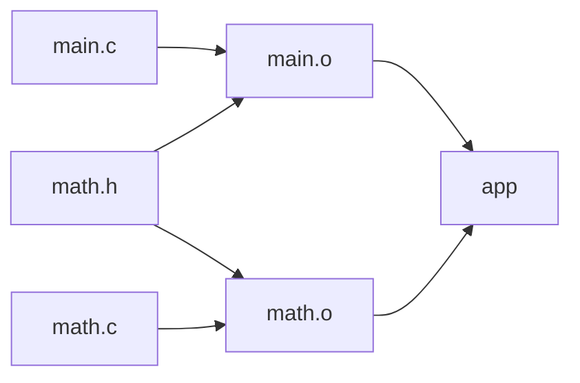

# 의존성과 증분 빌드

빌드 시스템은 입력과 출력 사이의 관계를 그래프로 표현합니다. 보통 순환이 없는 방향 그래프인 **DAG(Directed Acyclic Graph)**를 사용합니다. A를 만들려면 B가 필요하고 B를 만들려면 A가 필요한 관계는 정상적으로 실행 순서를 정할 수 없습니다.

## 그래프가 실행 순서를 정한다

다음 그림의 화살표는 입력에서 그 입력을 사용하는 결과물로 향합니다.



- `main.o`와 `math.o`는 서로의 출력이 필요 없으므로 병렬로 만들 수 있습니다.
- `app`의 링크는 두 오브젝트가 준비된 뒤에 실행합니다.
- `math.c`가 바뀌면 `math.o`를 다시 만들고 `app`을 다시 링크합니다.
- 두 소스가 포함하는 `math.h`가 바뀌면 두 오브젝트가 모두 다시 필요합니다.

패키지 관리자의 의존성 그래프는 주로 패키지·버전 관계를 다룹니다. 빌드 그래프는 파일이나 작업 사이의 관계까지 다룹니다. 둘은 연결되지만 같은 것은 아닙니다.

## 증분 빌드와 캐시

**증분 빌드(Incremental build)**는 변경의 영향을 받는 작업만 다시 수행합니다. **빌드 캐시(Build cache)**는 일치하는 입력으로 이전에 만든 출력을 찾아 재사용합니다. 어떤 작업이 필요하다고 판단되더라도 캐시가 있으면 실제 실행은 생략할 수 있습니다.

| 변경 감지 방식 | 원리 | 주의점 |
| --- | --- | --- |
| 수정 시각 비교 | 출력이 없거나 입력이 출력보다 새로우면 실행 | 파일 내용이나 명령 변경을 모두 감지하지는 못함 |
| 내용 해시 비교 | 입력 내용의 해시를 비교 | 입력 목록이 빠지면 잘못된 재사용 가능 |
| 작업 정보 비교 | 명령, 옵션, 도구 등의 변화를 추적 | 포함하는 정보는 도구마다 다름 |

일반적인 Make 규칙은 파일 수정 시각을 기준으로 합니다. `CFLAGS` 값만 바꿔도 기존 오브젝트가 자동으로 갱신된다고 가정하면 안 됩니다. 설정별 빌드 디렉터리를 나누거나, 설정 변경을 의존성에 반영하거나, 필요한 경우 해당 출력을 지우고 다시 빌드합니다.

## 올바른 의존성 선언

```makefile
app: main.o math.o
	$(CC) main.o math.o -o app

main.o: main.c math.h
	$(CC) -c main.c -o main.o

math.o: math.c math.h
	$(CC) -c math.c -o math.o
```

레시피 줄 앞에는 실제 TAB이 필요합니다. 큰 프로젝트에서는 헤더 목록을 직접 관리하기보다 컴파일러가 생성한 의존성 파일을 사용합니다. [실습](./c-build-example.md)에서 `-MMD -MP`를 사용합니다.

생성되는 헤더가 있다면 **코드 생성 작업 → 헤더 → 컴파일** 관계도 선언해야 합니다. 컴파일 후 생성되는 의존성 파일만으로는 최초 빌드에서 아직 없는 헤더의 생성 순서까지 해결할 수 없습니다.

### 나열 순서와 실행 순서는 다르다

```makefile
deploy: build test
```

이 규칙은 `deploy` 전에 `build`와 `test`가 완료되어야 한다는 뜻입니다. 둘 사이의 순서를 보장하지 않으며 병렬로 실행될 수 있습니다. 테스트가 빌드 결과를 사용한다면 다음처럼 직접 연결합니다.

```makefile
.PHONY: build test deploy
test: build
deploy: test
```

작업 이름에는 `.PHONY`를 사용하고, 실제 결과 파일을 나타내는 타깃에는 불필요하게 붙이지 않습니다. 파일 타깃을 `.PHONY`로 만들면 매번 실행되어 증분 빌드의 이점이 사라집니다.

## 확인 체크리스트

- [ ] 같은 명령을 다시 실행하면 불필요한 컴파일이 생략되는가?
- [ ] 소스와 공용 헤더를 각각 바꿨을 때 필요한 출력이 갱신되는가?
- [ ] 생성 파일이 없는 첫 빌드도 성공하는가?
- [ ] 병렬 빌드에서도 생성 순서와 출력 경로가 충돌하지 않는가?
- [ ] 컴파일 옵션·툴체인이 바뀌면 이전 출력이 잘못 재사용되지 않는가?

참고: [GNU Make 매뉴얼](https://www.gnu.org/software/make/manual/make.html)
