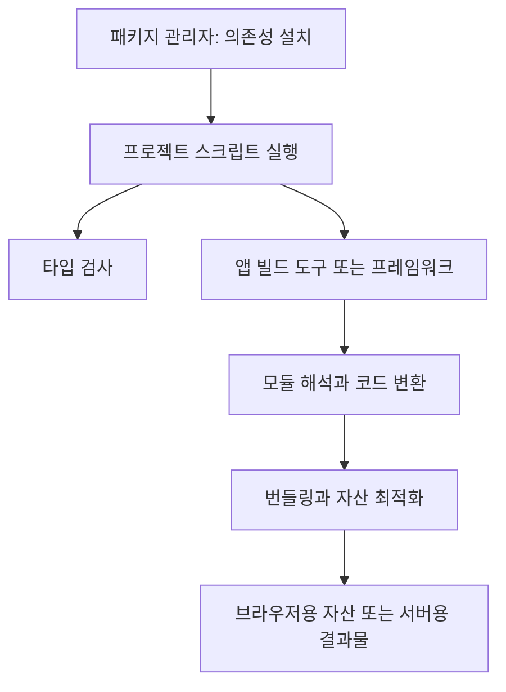

# JavaScript 빌드 도구의 역할과 선택

JavaScript는 런타임에서 직접 실행할 수 있지만, 프로젝트에서는 TypeScript·JSX 변환, 모듈 연결, CSS·이미지 처리, 대상 환경에 맞춘 최적화가 필요할 수 있습니다. 각 역할을 여러 도구가 나누어 수행합니다.

## 전체 흐름

그림은 역할을 나눈 것입니다. 실제 작업 순서와 병렬 실행 여부는 프로젝트 스크립트가 결정합니다. 번들러 내부에서도 모듈을 탐색하며 변환하는 등 단계가 서로 맞물립니다.

## 도구별 책임

| 분류 | 대표 도구 | 하는 일 | 구분할 점 |
| --- | --- | --- | --- |
| 패키지 관리자 | npm, pnpm, Yarn | 의존성 해석·설치, lockfile, workspace, 스크립트 실행 | 설치 속도와 앱 빌드 속도는 별개 |
| 타입 검사·컴파일 | TypeScript의 `tsc` | 타입 검사, JS·타입 선언 파일 출력 | 일반적인 웹 번들러는 아님 |
| 코드 변환기 | Babel, SWC | JS 문법·JSX·TS 구문 변환 | TS 타입 구문 제거가 타입 검사를 뜻하지 않음 |
| 변환·번들러 | esbuild | 코드 변환, 번들링, 압축 | 타입 검사와 프레임워크 기능은 별도 |
| 번들러 | webpack, Rollup, Rspack, Rolldown | 모듈 그래프 구성, 청크 생성, 플러그인 기반 처리 | 지원 설정·플러그인·최적화 방식이 다름 |
| 앱 빌드 도구 | Vite, Parcel, Rsbuild | 개발 서버, 빌드 설정, 자산 처리 통합 | 내부 엔진과 지원 기능은 버전에 따라 확인 |
| 프레임워크 빌드 | Next.js, Nuxt, Angular CLI 등 | 라우팅·SSR·프리렌더링 등 프레임워크에 맞는 빌드 | 프레임워크가 선택한 빌드 경로를 우선 사용 |
| 작업 관리·캐시 | Turborepo, Nx | 패키지·프로젝트 간 작업 순서, 캐시, 변경 영향 분석 등 | 실제 컴파일·번들링은 각 작업의 도구가 수행 |
| 범용 작업 자동화 | npm scripts, Gulp, Grunt | 명령 조합 또는 파일 처리 작업 자동화 | npm scripts 자체에는 작업 결과 캐시가 없음 |

Bun은 런타임·패키지 관리자·번들러 등 여러 기능을 제공합니다. `bun run build`는 스크립트 실행이고 `bun build`는 번들러 호출이므로 구분합니다. 런타임을 바꿀 때는 Node.js API와 도구의 호환성도 확인합니다.

## 자주 비교하는 도구

| 도구 | 이해할 특징 | 도입·유지 판단 기준 |
| --- | --- | --- |
| Vite | 개발 서버와 배포 빌드를 통합하고 플러그인으로 확장 | 일반 웹 앱에서 필요한 프레임워크 통합·플러그인 지원 |
| webpack | loader로 파일 변환, plugin으로 빌드 과정 확장 | 기존 설정, 특수 자산 처리, 플러그인 의존성 |
| Rollup | ESM 중심 모듈 분석, 출력 형식과 외부 의존성 제어 | 라이브러리 출력 구성과 플러그인 요구 |
| esbuild | 변환·번들링 API와 CLI 제공 | 간단한 앱·서버 번들 또는 다른 도구 내부의 변환 작업 |
| Parcel | 파일 유형을 분석해 기본 구성을 자동화 | 별도 설정 없이 지원되는 범위와 필요한 확장 |
| Rspack / Rsbuild | Rspack은 webpack 호환성을 지향하는 번들러, Rsbuild는 이를 활용한 빌드 도구 | 기존 loader·plugin·설정의 실제 호환 범위 |
| Rolldown | Rollup 호환성을 지향하는 번들러 | 사용하는 상위 도구 버전과 플러그인 호환 범위 |
| Turbopack | Next.js에 통합된 번들러 | 해당 Next.js 버전의 개발·배포 빌드 지원과 설정 |

호환성을 지향해도 모든 플러그인이 그대로 동작하는 것은 아닙니다. Vite의 내부 번들러·변환기나 Next.js의 기본 엔진을 모든 버전에 공통인 사실로 외우기보다, 프로젝트 버전과 마이그레이션 문서를 확인합니다.

## 목적별 시작점

- **일반 브라우저 앱**: 프레임워크 권장 도구 또는 Vite 같은 앱 빌드 도구를 사용합니다.
- **SSR·풀스택 앱**: 프레임워크의 빌드 명령과 배포 어댑터를 따릅니다. 서버 코드와 브라우저 코드를 모두 고려합니다.
- **npm 라이브러리**: `tsc`로 모듈·타입 선언을 내보내는 것으로 충분한지 먼저 판단합니다. 번들이 필요하면 Rollup, Vite의 라이브러리 모드, esbuild 등을 검토합니다.
- **Node.js 서비스·CLI**: 목표 Node.js 버전이 직접 실행할 수 있는 JS라면 별도 번들 없이 배포할 수도 있습니다. TS 변환, 파일 수, 외부 의존성 배포 요구에 따라 도구를 선택합니다.
- **모노레포**: workspace로 패키지를 관리하고, 작업 순서·캐시 관리가 복잡해지면 Turborepo나 Nx를 검토합니다.

빌드 시간을 비교할 때는 설치, 개발 서버 시작, HMR, 배포 빌드, 타입 검사 시간을 분리해서 측정합니다. 캐시 유무·출력 대상·소스맵·압축 옵션이 다른 측정으로 도구의 속도를 단정하지 않습니다.

## 이어서 읽기

- [모듈과 번들링 원리](./javascript-modules.md)
- [개발·배포 빌드와 모노레포](./javascript-workflows.md)

## 공식 자료

- [npm scripts](https://docs.npmjs.com/cli/using-npm/scripts), [pnpm](https://pnpm.io/), [Yarn](https://yarnpkg.com/), [Bun](https://bun.sh/docs)
- [TypeScript](https://www.typescriptlang.org/docs/), [Babel](https://babeljs.io/docs/), [SWC](https://swc.rs/docs/getting-started), [esbuild](https://esbuild.github.io/)
- [Vite](https://vite.dev/guide/), [webpack](https://webpack.js.org/concepts/), [Rollup](https://rollupjs.org/), [Parcel](https://parceljs.org/)
- [Rspack](https://rspack.dev/), [Rsbuild](https://rsbuild.dev/), [Rolldown](https://rolldown.rs/), [Next.js](https://nextjs.org/docs)
- [Turborepo](https://turborepo.com/docs), [Nx](https://nx.dev/), [Gulp](https://gulpjs.com/docs/en/getting-started/quick-start/), [Grunt](https://gruntjs.com/getting-started)
